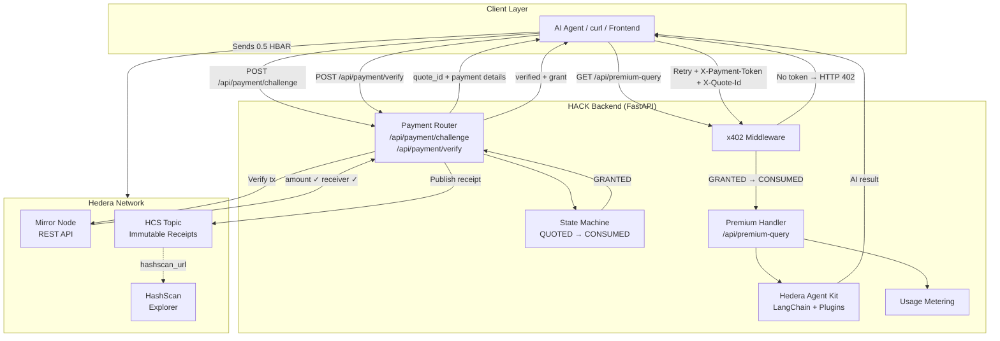
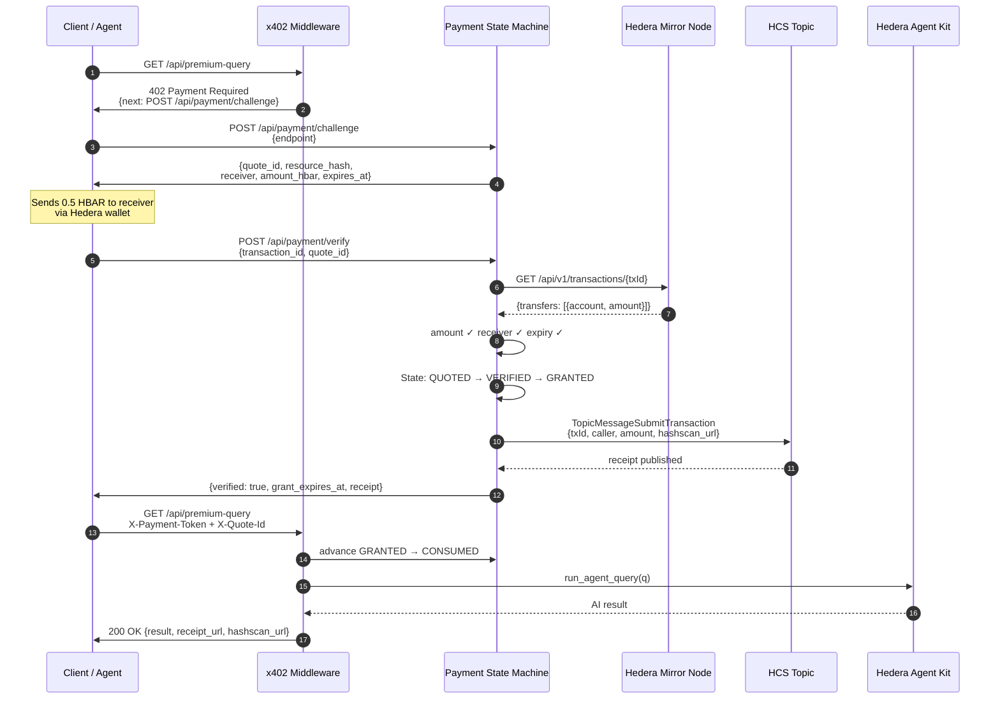
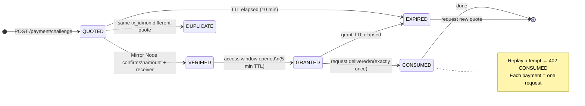
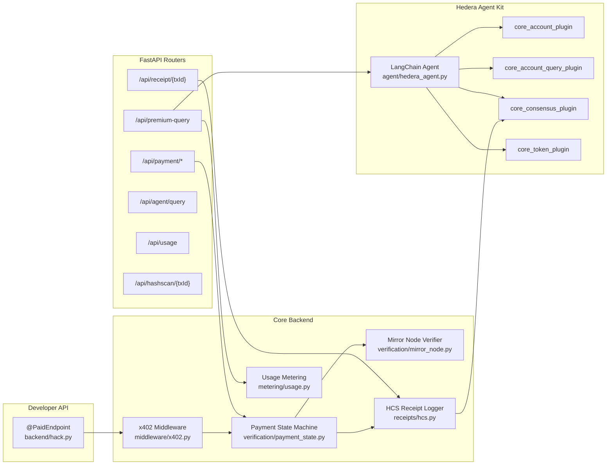

# Architecture

## System Overview

---

## Payment Flow (Sequence)

---

## Payment State Machine

---

## Component Map

---

## Component Responsibilities

| Component | File | Responsibility |
|---|---|---|
| `@PaidEndpoint` | `backend/hack.py` | One-line decorator for monetizing any route |
| x402 Middleware | `backend/middleware/x402.py` | Global gate — enforces GRANTED state before handler |
| Payment State Machine | `backend/verification/payment_state.py` | QUOTED→CONSUMED with replay protection + TTLs |
| Mirror Node Verifier | `backend/verification/mirror_node.py` | Stateless on-chain payment confirmation |
| HCS Receipt Logger | `backend/receipts/hcs.py` | Publishes immutable receipts via `core_consensus_plugin` |
| Usage Metering | `backend/metering/usage.py` | In-memory per-request tracking |
| Hedera Agent | `backend/agent/hedera_agent.py` | LangChain agent backed by Hedera Kit plugins |
| FastAPI App | `backend/main.py` | Wires all components together |
| Demo UI | `frontend/src/app/page.tsx` | Next.js interactive demo |
| MCP Tool Example | `examples/mcp/paid_tool.py` | Paid MCP tool pattern |

---

## Security Notes

- The operator private key is used **only** for HCS topic publishing — it is loaded from `.env` and never echoed in API responses.
- Payment proofs are bound to a `quote_id` + `resource_hash`. Cross-quote replay is rejected with 409.
- Each verified payment is consumed **exactly once** (CONSUMED state). Retrying with the same headers returns 402.
- All transactions are on Hedera **testnet** for the MVP. Mainnet requires explicit operator opt-in.
