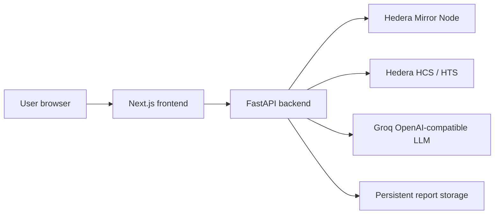

# HACK Deployment Guide

This repository deploys as **two services**:

1. **Backend** — FastAPI app at `demo.main:app`, exposes `/api/*`, verifies Hedera payments, runs audits, writes reports, and mints certificates.
2. **Frontend** — Next.js app in `frontend/`, points to the backend via `NEXT_PUBLIC_API_BASE_URL`.

Do **not** deploy real secrets in the frontend. Hedera operator keys, Groq keys, HCS topic IDs, and minting credentials belong only in the backend environment.

## Architecture



## What must persist

The backend writes runtime artifacts during audits and certification:

- `COMPLIANCE_STORE_DIR` — reports, PDFs, SKILL.md files, certificate index.
- `HACK_STATE_FILE` — stores the auto-created soulbound NFT token id when `HACK_NFT_TOKEN_ID` is blank.

For Docker, the defaults are:

```text
COMPLIANCE_STORE_DIR=/app/data/reports
HACK_STATE_FILE=/app/state/.hack_state.json
```

Mount `/app/data` and `/app/state` as persistent volumes.

## Backend environment variables

Use `.env.production.example` as the production checklist. Required for the real pipeline:

```bash
HEDERA_NETWORK=testnet
HEDERA_OPERATOR_ID=0.0.YOUR_OPERATOR_ACCOUNT
HEDERA_OPERATOR_KEY=YOUR_OPERATOR_PRIVATE_KEY
X402_PAYMENT_RECEIVER_ACCOUNT_ID=0.0.YOUR_RECEIVER_ACCOUNT
X402_PAYMENT_AMOUNT_HBAR=0.5
X402_PAYMENT_MEMO=hack-payment
HCS_RECEIPT_TOPIC_ID=0.0.YOUR_TOPIC_ID
GROQ_API_KEY=YOUR_GROQ_API_KEY
LLM_MODEL=openai/gpt-oss-120b
LLM_BASE_URL=https://api.groq.com/openai/v1
COMPLIANCE_STORE_DIR=/app/data/reports
HACK_STATE_FILE=/app/state/.hack_state.json
FRONTEND_ORIGIN=https://your-frontend-domain.example.com
```

`HACK_NFT_TOKEN_ID` can be blank. If blank, the first passing audit creates the HTS NFT collection and stores the token id at `HACK_STATE_FILE`.

## Frontend environment variables

Use `frontend/.env.production.example` as the checklist:

```bash
NEXT_PUBLIC_API_BASE_URL=https://your-backend-domain.example.com
NEXT_PUBLIC_HEDERA_NETWORK=testnet
NEXT_PUBLIC_WALLETCONNECT_PROJECT_ID=YOUR_REOWN_PROJECT_ID
```

Important: `NEXT_PUBLIC_*` values are baked into the Next.js bundle at build time. If the backend URL changes, rebuild and redeploy the frontend.

## Option A — Local/VM deployment with Docker Compose

From the repo root:

```bash
cp .env.production.example .env
# Fill .env with real backend secrets.

# If using the compose frontend service, export this value before build:
export NEXT_PUBLIC_WALLETCONNECT_PROJECT_ID=YOUR_REOWN_PROJECT_ID

docker compose up --build
```

Then verify:

```bash
curl http://localhost:8000/api/health
open http://localhost:3000
```

Services:

- Backend: `http://localhost:8000`
- Frontend: `http://localhost:3000`

## Option B — Backend as a container service + frontend as hosted Next.js

This is the recommended split for hackathon/demo deployment.

### Backend

Deploy the root `Dockerfile` as a web service.

Settings:

- Build context: repository root
- Dockerfile: `Dockerfile`
- Port: `8000` or platform-provided `$PORT`
- Start command: already in Dockerfile
- Persistent disks/volumes:
  - mount to `/app/data`
  - mount to `/app/state`
- Environment: values from `.env.production.example`

After deploy:

```bash
curl https://your-backend-domain.example.com/api/health
```

### Frontend

Deploy the `frontend/` directory as a Next.js app.

Settings:

- Root directory: `frontend`
- Install command: `npm install --legacy-peer-deps`
- Build command: `npm run build`
- Start command: `npm run start`
- Public env at build time:
  - `NEXT_PUBLIC_API_BASE_URL=https://your-backend-domain.example.com`
  - `NEXT_PUBLIC_HEDERA_NETWORK=testnet`
  - `NEXT_PUBLIC_WALLETCONNECT_PROJECT_ID=YOUR_REOWN_PROJECT_ID`

After deploy:

- Open `/`
- Open `/certification`
- Open `/certificates`
- Open `/docs`

## Option C — Manual backend process

If you are not using Docker:

```bash
python -m venv .venv
source .venv/bin/activate
pip install -e ".[hedera]"
export COMPLIANCE_STORE_DIR=./data/reports
export HACK_STATE_FILE=./.hack_state.json
uvicorn demo.main:app --host 0.0.0.0 --port 8000
```

On Windows PowerShell:

```powershell
python -m venv .venv
.\.venv\Scripts\Activate.ps1
pip install -e ".[hedera]"
$env:COMPLIANCE_STORE_DIR = "./data/reports"
$env:HACK_STATE_FILE = "./.hack_state.json"
uvicorn demo.main:app --host 0.0.0.0 --port 8000
```

## Production smoke test

Run this after both services are live.

1. Open the frontend `/certification` page.
2. Submit a service with:
   - service name
   - type (`mcp`, `fastapi`, `agent`, or `other`)
   - primary endpoint URL
   - optional repo URL
3. The backend returns a real quote from `/api/audit/submit`.
4. Pay the quote with WalletConnect/Reown.
5. The backend verifies payment via Mirror Node.
6. The backend runs:
   - live HTTP probes
   - static GitHub raw file scan
   - Groq LLM recommendations
7. If score is at least 70, the backend mints the soulbound HTS NFT.
8. Verify pages:
   - `/certification/{report_id}`
   - `/certification/certificate/{certificate_id}`
   - `/certificates`
9. Open HashScan links from the report/certificate pages.

## Operational notes

- Mirror Node can lag a few seconds after a wallet transfer. The frontend retries verification automatically.
- First passing certification may take longer because the backend creates the HTS NFT collection before minting the first certificate.
- If `HACK_NFT_TOKEN_ID` is blank and `HACK_STATE_FILE` is not persistent, a restart can cause the backend to create a new NFT collection later. Use persistent state storage.
- The backend CORS origin must include the deployed frontend domain via `FRONTEND_ORIGIN` or `CORS_ALLOW_ORIGINS`.
- The frontend must be rebuilt if `NEXT_PUBLIC_API_BASE_URL` or `NEXT_PUBLIC_WALLETCONNECT_PROJECT_ID` changes.

## Files added for deployment

- `Dockerfile` — backend container
- `.dockerignore` — safe Docker build context
- `frontend/Dockerfile` — frontend container
- `docker-compose.yml` — backend + frontend local/VM deployment
- `.env.production.example` — backend env checklist
- `frontend/.env.production.example` — frontend env checklist
- `DEPLOYMENT.md` — this guide
