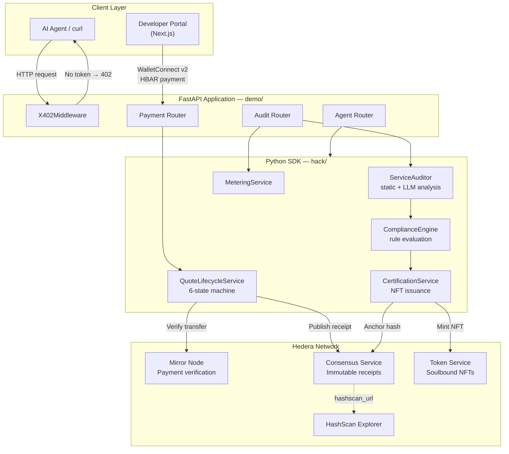
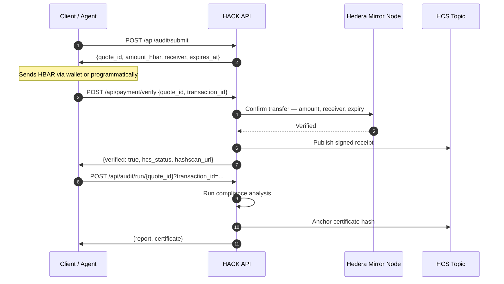
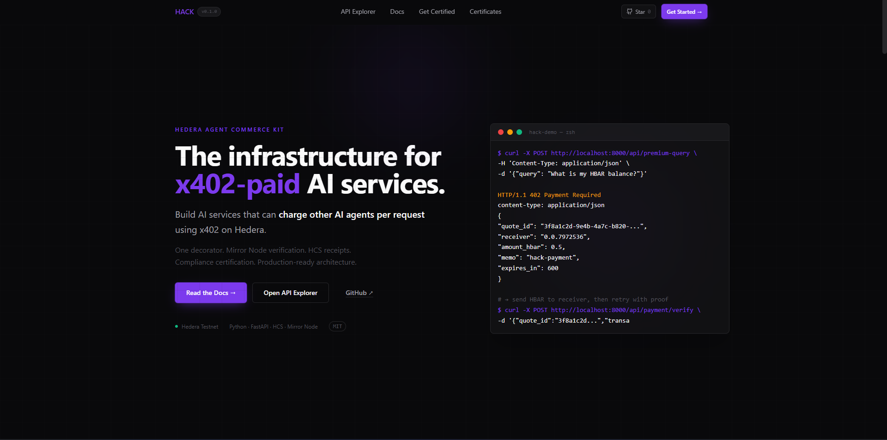
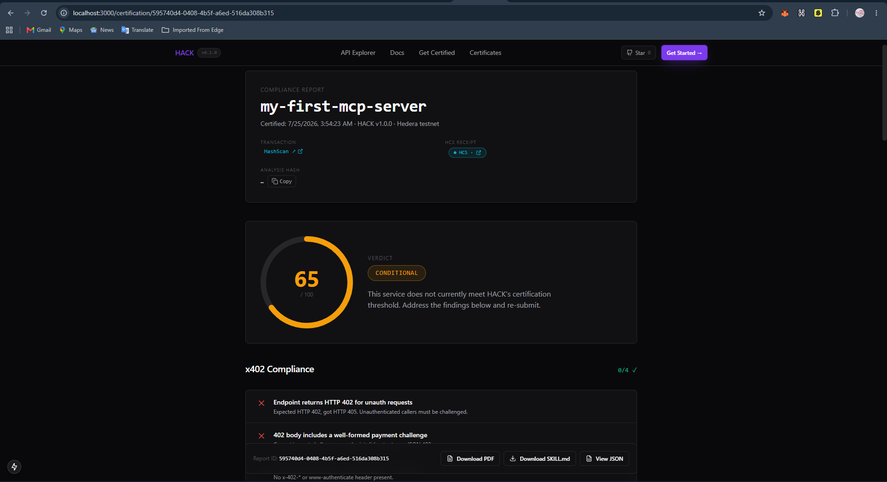
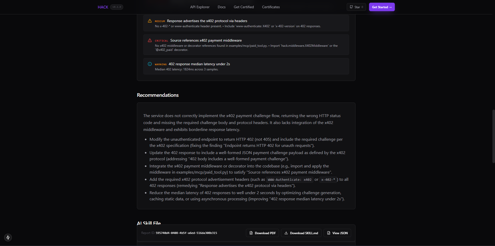
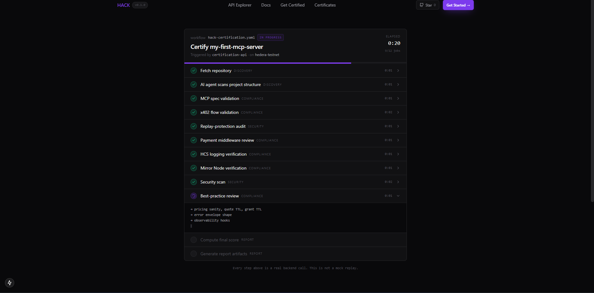
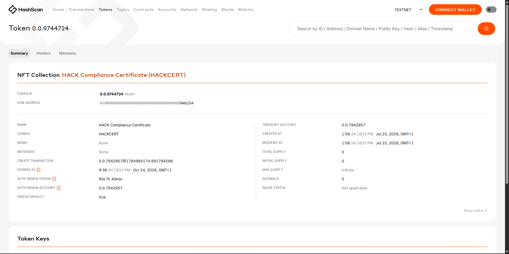
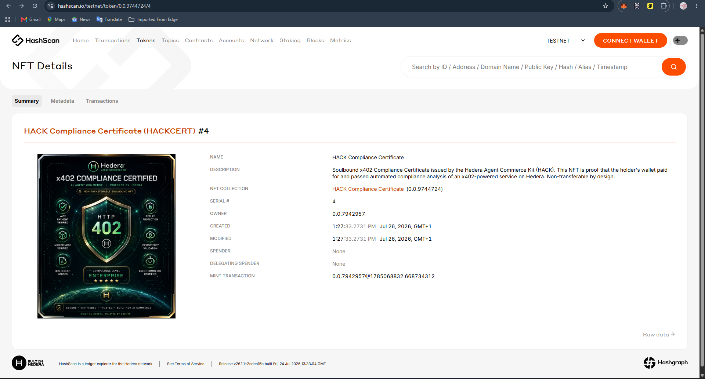
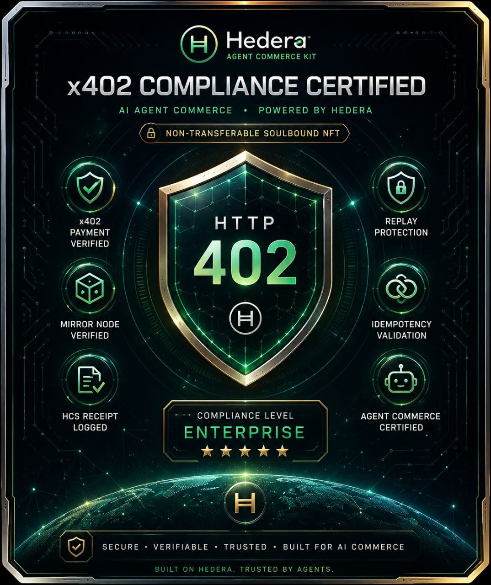

# Hedera Agent Commerce Kit

**Open-source compliance infrastructure for x402-powered AI commerce on Hedera.**

[](https://python.org)
[](https://fastapi.tiangolo.com)
[](https://nextjs.org)
[](LICENSE)
[](#testing)

> HACK enables AI agents, MCP servers, autonomous APIs, and agentic services to monetize endpoints, verify payments on-chain, perform compliance analysis, publish immutable audit receipts to Hedera Consensus Service, and issue verifiable soulbound compliance certificates — all without centralized billing infrastructure.

> **Live on Hedera testnet** · [NFT Collection 0.0.9744724](https://hashscan.io/testnet/token/0.0.9744724) · [HCS Topic 0.0.9702133](https://hashscan.io/testnet/topic/0.0.9702133) · [Certificate #4](https://hashscan.io/testnet/token/0.0.9744724/4)

---

## The Problem

AI agents need to transact with other services. The web's existing payment infrastructure was designed for humans: accounts, subscriptions, API keys, and monthly invoices. That model breaks the moment software needs to autonomously pay for services on a per-request basis.

Beyond payment, trust is absent from the current model. When an AI agent calls a third-party service, there is no standardized mechanism to verify that the service has been audited, that its payment flow is compliant, or that any of its claims are anchored to an immutable record.

The gap is not just payment — it is verifiable, automated compliance for the AI commerce layer.

---

## The Solution

HACK implements a full trust layer for AI commerce using the [x402 payment protocol](https://x402.org) and Hedera's public infrastructure:

- **HTTP 402 native payments** — agents pay per request using standard HTTP semantics
- **On-chain verification** — every payment is confirmed against the Hedera Mirror Node with no third-party oracle
- **Immutable audit trail** — every verified payment publishes a signed receipt to Hedera Consensus Service
- **Automated compliance** — a static and LLM-powered audit engine evaluates services against a structured rule set
- **Verifiable certificates** — compliant services receive soulbound NFTs minted on Hedera Token Service, permanently linking the audit result to an on-chain asset

The result is a portable, open-source compliance and commerce platform that any developer can deploy, extend, and integrate into their AI infrastructure.

---

## Platform Components

### Python SDK — `hack/`
The installable toolkit. Provides the `@PaidEndpoint` decorator, `X402Middleware`, `QuoteLifecycleService`, `ComplianceEngine`, `CertificationService`, and the full service container with dependency injection. Designed to be imported independently of the demo server.

### Compliance Engine
A rule-based and LLM-assisted auditor that evaluates deployed services against a structured compliance framework. Produces structured `ServiceAuditReport` objects with per-section findings, remediation guidance, and an overall compliance score.

### Payment Gateway
An implementation of the x402 payment protocol backed by a six-state lifecycle machine (`QUOTED → VERIFIED → GRANTED → CONSUMED`), Mirror Node payment verification, replay protection, and per-request access enforcement.

### Certification Engine
Issues soulbound compliance certificates as HTS NFTs. Each certificate references the audit report, the HCS receipt, the on-chain transaction, and a generated `SKILL.md` descriptor designed for agent ingestion.

### Developer Portal — `frontend/`
A Next.js application providing a live API explorer, a compliance certification submission and report viewer, a certificate gallery with HashScan links, and integrated WalletConnect v2 support for real HBAR payments from a browser wallet.

### Agent Toolkit — `hack/agent/`
A LangChain agent backed by Hedera Agent Kit plugins. Supports natural-language queries over Hedera account data, HCS topic management, and HTS token operations. Powers the `/api/agent/query` endpoint.

---

## Architecture



---

## End-to-End Payment Flow



---

## Key Features

**Six-state payment lifecycle**
`QUOTED → VERIFIED → GRANTED → CONSUMED` with `EXPIRED` and `DUPLICATE` terminal states. Each transition is validated independently. Replay attacks are rejected at the transaction ID level.

**Mirror Node verification**
Payment confirmation uses the Hedera Mirror Node REST API directly. No third-party oracle, no webhook dependency. Amount, receiver, expiry, and replay status are all validated in a single network call.

**HCS immutable receipts**
Every verified payment publishes a structured receipt to a Hedera Consensus Service topic. Receipts include transaction ID, caller, endpoint, amount, timestamp, and a HashScan link. The HCS sequence number provides ordering guarantees.

**Automated compliance auditing**
The `ServiceAuditor` runs static probes against a live endpoint and an optional GitHub repository, then passes structured findings to an LLM for remediation guidance. Produces section-by-section findings across payment flow, performance, security, architecture, and best practices.

**Soulbound NFT certificates**
Services that pass compliance analysis receive a non-transferable HTS NFT. The token metadata references the audit report ID, HCS receipt, and a SHA-256 hash of the full report JSON. This anchors the compliance result permanently on-chain.

**`@PaidEndpoint` decorator**
```python
from hack import PaidEndpoint

@app.get("/premium")
@PaidEndpoint(price="0.5 HBAR")
async def premium(request: Request):
    return {"result": "access granted"}
```
One decorator handles challenge issuance, Mirror Node verification, lifecycle management, HCS receipt publishing, and usage metering.

**Dependency injection throughout**
Every service — `QuoteStore`, `PaymentVerifier`, `ReceiptService`, `MeteringService` — is defined as an abstract interface and injected via `ServiceContainer`. Implementations are swappable without modifying business logic.

---

## Repository Structure

```
Hedera-Agent-Commerce-Kit/
│
├── hack/                    Python SDK — installable toolkit, zero HTTP routing
│   ├── models/              Pydantic v2 domain models
│   ├── core/                Interfaces, exceptions, QuoteLifecycleService
│   ├── stores/              QuoteStore implementations
│   ├── verifiers/           Mirror Node payment verifier
│   ├── receipts/            HCS receipt service
│   ├── metering/            Usage metering service
│   ├── compliance/          ComplianceEngine and CertificationService
│   ├── middleware/          X402Middleware (Starlette/FastAPI)
│   ├── audit/               ServiceAuditor — static + LLM compliance analysis
│   ├── nft/                 NftMintingService — HTS soulbound certificates
│   ├── reporting/           PDF and SKILL.md report generators
│   ├── decorator.py         @PaidEndpoint
│   └── container.py         ServiceContainer — DI root
│
├── demo/                    FastAPI application — HTTP wiring only
│   └── routers/             health, payment, audit, compliance, agent, receipts
│
├── frontend/                Next.js 15 developer portal and compliance dashboard
│   ├── app/                 App Router pages
│   ├── components/          React components
│   ├── hooks/               useWalletConnect — WalletConnect v2 + Hedera SDK
│   └── lib/                 API client and type definitions
│
├── tests/                   pytest suite — state machine, verifier, compliance, middleware
├── docs/                    Safety rules, demo script, decorator reference
├── examples/mcp/            Paid MCP tool integration pattern
├── scripts/                 Developer utilities
├── data/reports/            Runtime output — reports, PDFs, certificates (not committed)
│
├── pyproject.toml           Python package definition
├── .env.example             Backend environment template
├── STRUCTURE.md             Full directory reference
└── ARCHITECTURE.md          Mermaid system diagrams
```

See [STRUCTURE.md](./STRUCTURE.md) for a detailed description of every directory.

---

## Quick Start

**Prerequisites**

- Python 3.10 or later
- Node.js 18 or later
- A free [Hedera testnet account](https://portal.hedera.com)
- One LLM API key (OpenAI, Anthropic, or Groq — Groq has a free tier)
- A free [Reown Cloud](https://cloud.reown.com) WalletConnect project ID

**1. Clone the repository**

```bash
git clone https://github.com/De-real-iManuel/Hedera-Agent-Commerce-Kit
cd Hedera-Agent-Commerce-Kit
```

**2. Configure the backend**

```bash
cp .env.example .env
# Edit .env — fill in HEDERA_OPERATOR_ID, HEDERA_OPERATOR_KEY,
# X402_PAYMENT_RECEIVER_ACCOUNT_ID, HCS_RECEIPT_TOPIC_ID, and one LLM key.
```

**3. Install Python dependencies**

```bash
python -m venv .venv
.venv\Scripts\activate        # Windows
# source .venv/bin/activate   # macOS / Linux
pip install -e ".[langchain]"
```

**4. Start the backend**

```bash
uvicorn demo.main:app --reload --port 8000
# API available at http://localhost:8000
# Interactive docs at http://localhost:8000/docs
```

**5. Configure and start the frontend**

```bash
cd frontend
cp .env.local.example .env.local
# Edit .env.local — fill in NEXT_PUBLIC_PAYMENT_RECEIVER,
# NEXT_PUBLIC_HCS_TOPIC_ID, and NEXT_PUBLIC_WALLETCONNECT_PROJECT_ID.
npm install
npm run dev
# Portal available at http://localhost:3000
```

---

## Configuration

### Backend — `.env`

| Variable | Description |
|----------|-------------|
| `HEDERA_OPERATOR_ID` | Hedera account ID that signs HCS messages (e.g. `0.0.123456`) |
| `HEDERA_OPERATOR_KEY` | ED25519 or ECDSA private key for the operator account |
| `HEDERA_NETWORK` | `testnet` or `mainnet` |
| `X402_PAYMENT_RECEIVER_ACCOUNT_ID` | Account that receives HBAR payments |
| `X402_PAYMENT_AMOUNT_HBAR` | Amount charged per request (default `0.5`) |
| `HCS_RECEIPT_TOPIC_ID` | HCS topic for immutable payment receipts |
| `OPENAI_API_KEY` / `GROQ_API_KEY` / `ANTHROPIC_API_KEY` | LLM provider — one required |
| `GITHUB_TOKEN` | Optional — enables GitHub repository analysis in audits |

### Frontend — `frontend/.env.local`

| Variable | Description |
|----------|-------------|
| `NEXT_PUBLIC_API_BASE_URL` | Backend URL (default `http://localhost:8000`) |
| `NEXT_PUBLIC_HEDERA_NETWORK` | `testnet` or `mainnet` |
| `NEXT_PUBLIC_PAYMENT_RECEIVER` | Receiver account shown in payment UI |
| `NEXT_PUBLIC_HCS_TOPIC_ID` | HCS topic shown in receipt links |
| `NEXT_PUBLIC_WALLETCONNECT_PROJECT_ID` | Reown Cloud project ID for wallet pairing |

---

## API Overview

Full interactive documentation is available at `http://localhost:8000/docs`.

| Method | Endpoint | Description |
|--------|----------|-------------|
| `GET` | `/api/health` | Service health and version |
| `POST` | `/api/payment/challenge` | Issue an x402 payment challenge |
| `POST` | `/api/payment/verify` | Verify HBAR transfer via Mirror Node |
| `GET` | `/api/payment/status/{quote_id}` | Poll current quote lifecycle state |
| `GET` | `/api/premium-query` | x402-gated Agent Kit endpoint |
| `POST` | `/api/audit/submit` | Submit a service for compliance audit |
| `POST` | `/api/audit/run/{quote_id}` | Execute audit after payment |
| `GET` | `/api/audit/report/{report_id}` | Retrieve a compliance report |
| `GET` | `/api/audit/report/{report_id}/pdf` | Download report as PDF |
| `GET` | `/api/audit/report/{report_id}/skill.md` | Download agent-ingestible SKILL.md |
| `GET` | `/api/audit/certificate/{cert_id}` | Retrieve a soulbound certificate |
| `GET` | `/api/audit/certificates` | List all issued certificates |
| `POST` | `/api/compliance/check` | Run compliance rules on a payment |
| `GET` | `/api/receipt/{txId}` | Fetch HCS receipt for a transaction |
| `GET` | `/api/usage` | Aggregated usage metering data |
| `GET` | `/api/agent/query` | Natural-language Hedera agent query |

---

## Why Hedera

| Hedera Capability | How HACK Uses It |
|-------------------|-----------------|
| **Mirror Node REST API** | Stateless, oracle-free on-chain payment verification. Amount, receiver, expiry, and replay status confirmed per request. |
| **Hedera Consensus Service (HCS)** | Immutable, ordered receipt log. Every verified payment and every compliance certificate is anchored to an HCS topic with a consensus timestamp. |
| **Hedera Token Service (HTS)** | Soulbound NFT compliance certificates. Non-transferable tokens permanently link a service's audit result to an on-chain asset. |
| **x402 Protocol** | Standard HTTP 402 payment negotiation. Payment metadata travels in HTTP headers — no new auth layer, no wallet SDK required on the client. |
| **3-second finality** | Payments are confirmed before a user interaction times out. No polling loops, no probabilistic confirmation. |
| **Fixed, predictable fees** | Agents know the cost of every Hedera operation before they execute. No gas estimation, no fee spikes. |
| **HashScan Explorer** | Every transaction, HCS message, and NFT mint has a permanent public URL generated automatically. |

---

## Developer Workflow

```bash
# Run the full test suite
python -m pytest tests/ -v

# Type-check the SDK
cd frontend && npm run typecheck

# Lint the frontend
cd frontend && npm run lint

# Verify a payment flow end-to-end (manual)
# 1. Start backend: uvicorn demo.main:app --reload
# 2. Open http://localhost:3000
# 3. Submit a service URL for compliance audit
# 4. Connect HashPack or Kabila via WalletConnect
# 5. Approve the HBAR payment in your wallet
# 6. View the compliance report and certificate
```

---

## Testing

```bash
python -m pytest tests/ -v
```

The test suite covers:

- `test_quote_lifecycle.py` — all six state transitions, expiry enforcement, and replay rejection
- `test_mirror_node.py` — Mirror Node verifier with mocked HTTP responses (respx)
- `test_compliance.py` — ComplianceEngine rule evaluation and CertificationService
- `test_middleware.py` — X402Middleware gate, bypass logic, and header parsing

Tests use in-memory implementations exclusively. No Hedera network access is required.

---

## Live On-Chain Proof

Real testnet transactions demonstrating the complete HACK payment and certification flow.

| Event | HashScan Link |
|-------|--------------|
| HBAR Payment (x402) | [0.0.9075201@1784939817.181941398](https://hashscan.io/testnet/transaction/0.0.9075201%401784939817.181941398) |
| HCS Receipt Topic | [0.0.9702133](https://hashscan.io/testnet/topic/0.0.9702133) |
| NFT Collection (HACKCERT) | [0.0.9744724](https://hashscan.io/testnet/token/0.0.9744724) |
| NFT Mint — Serial #4 | [0.0.7942957@1785068832.668734312](https://hashscan.io/testnet/transaction/0.0.7942957%401785068832.668734312) |
| NFT Certificate #4 | [0.0.9744724/4](https://hashscan.io/testnet/token/0.0.9744724/4) |

---

## Screenshots

**Landing Page**



---

**API Explorer — Live x402 Payment Flow**


---

**Compliance Report — Section-by-section audit findings**





---

**MCP Server Compliance Audit**



---

**Soulbound NFT Certificate — Created on Hedera HTS**



---

**NFT Minted on Hedera Testnet — HashScan confirmation**



---

**Certificate Image — Stored on IPFS, rendered by HashScan**



---

## Roadmap

**Delivered**
- [x] `@PaidEndpoint` decorator — one-line endpoint monetization
- [x] x402 middleware with six-state lifecycle and replay protection
- [x] Hedera Mirror Node verification
- [x] HCS immutable receipt publishing
- [x] Compliance engine with structured rule set
- [x] Static and LLM-assisted service auditor
- [x] Soulbound NFT certificate issuance via HTS
- [x] PDF and SKILL.md report generation
- [x] Next.js developer portal with WalletConnect v2
- [x] Dependency injection — all services injectable and testable
- [x] Typed Pydantic v2 models throughout
- [x] pytest suite with in-memory test fixtures

**Planned**
- [ ] `pip install hack-hedera` — PyPI distribution
- [ ] Persistent quote storage — SQLite, Redis, and Supabase adapters
- [ ] Multi-tier endpoint pricing
- [ ] Webhook notifications on payment lifecycle events
- [ ] Mainnet deployment guide with explicit operator opt-in controls
- [ ] TypeScript SDK for agent-side x402 payment handling
- [ ] OpenTelemetry instrumentation

---

## Contributing

Contributions are welcome. Please read the coding conventions in `rules/` before opening a pull request.

1. Fork the repository
2. Create a feature branch: `git checkout -b feature/your-feature`
3. Make your changes with tests
4. Run `python -m pytest tests/ -v` — all tests must pass
5. Open a pull request with a clear description of the change

For significant changes, open an issue first to discuss the approach.

---

## License

MIT — see [LICENSE](./LICENSE)

---

## References

- [STRUCTURE.md](./STRUCTURE.md) — full directory reference
- [ARCHITECTURE.md](./ARCHITECTURE.md) — Mermaid system, sequence, state, and component diagrams
- [docs/SAFETY.md](./docs/SAFETY.md) — key custody, replay protection, and testnet boundary rules
- [docs/DEMO_SCRIPT.md](./docs/DEMO_SCRIPT.md) — judge walkthrough under 5 minutes
- [Hedera Developer Portal](https://portal.hedera.com) — free testnet account and credentials
- [HashScan](https://hashscan.io) — Hedera block explorer
- [x402 Protocol](https://x402.org) — HTTP-native payment standard
- [Reown Cloud](https://cloud.reown.com) — WalletConnect project registration
