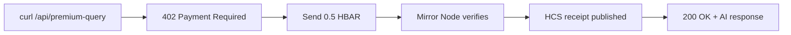
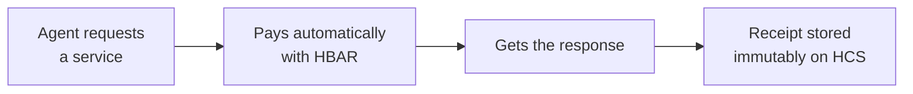
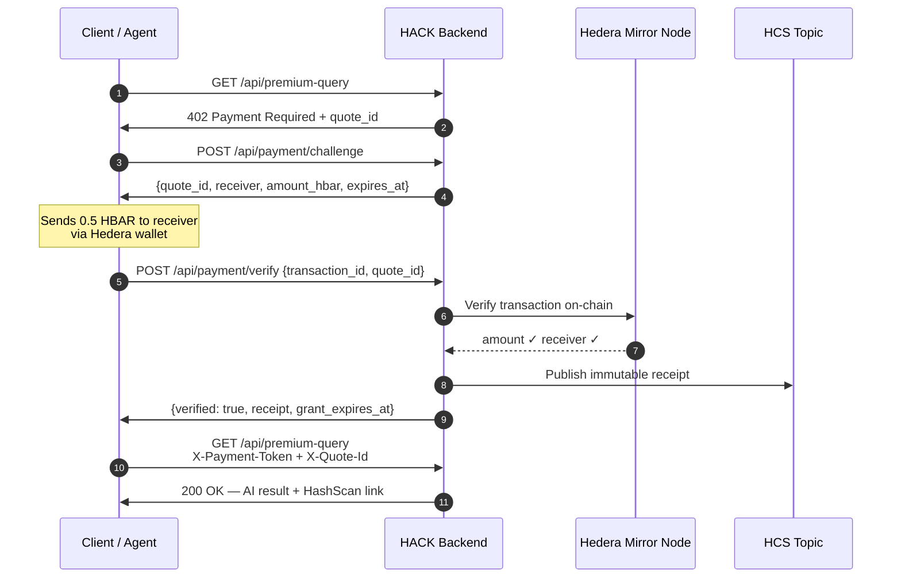
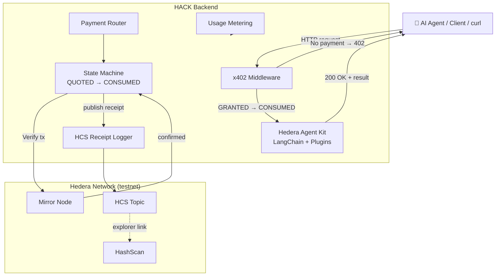

# Hedera Agent Commerce Kit

> **The open-source framework that lets any AI agent, API, or MCP tool charge for its work — using Hedera x402, HBAR micropayments, Mirror Node verification, and HCS receipts.**



[](https://python.org)
[](https://fastapi.tiangolo.com)
[](https://github.com/hashgraph/hedera-agent-kit-py)
[](LICENSE)

---

## The problem

AI agents cannot pay for things. They use API keys, subscriptions, and centralized billing — infrastructure designed for humans.

The future looks different:



**HACK makes payment as native as HTTP.**

---

## Why Hedera

| Property | Why it matters for agent commerce |
|---|---|
| **Fixed, predictable fees** | Agents can calculate cost before calling |
| **3-second finality** | Verification completes before the user notices |
| **Mirror Node REST API** | Free, public payment verification — no oracles needed |
| **HCS** | Tamper-proof, timestamped receipt for every transaction |
| **Hedera Agent Kit** | Official Python SDK — agents as first-class citizens |
| **x402 protocol** | Payment travels in HTTP headers — no new auth layer |

---

## Quick Start

**Prerequisites:** Python 3.10+, Node.js 18+, a free [Hedera testnet account](https://portal.hedera.com)

```bash
# 1. Clone
git clone https://github.com/your-org/hedera-agent-commerce-kit
cd hedera-agent-commerce-kit

# 2. Configure
cp .env.example .env
# → fill in HEDERA_OPERATOR_ID, HEDERA_OPERATOR_KEY,
#   HCS_RECEIPT_TOPIC_ID, X402_PAYMENT_RECEIVER_ACCOUNT_ID,
#   and one LLM key (OPENAI_API_KEY or GROQ_API_KEY)

# 3. Install everything
./scripts/install.sh

# 4. Start
./scripts/start-backend.sh    # terminal 1 → http://localhost:8000
./scripts/start-frontend.sh   # terminal 2 → http://localhost:3000
```

→ See [QUICKSTART.md](./QUICKSTART.md) for the full curl demo flow.

---

## The decorator API

The simplest way to monetize an endpoint:

```python
from fastapi import FastAPI, Request
from hack import PaidEndpoint

app = FastAPI()

@app.get("/premium")
@PaidEndpoint(price="0.5 HBAR", description="Premium AI insight")
async def premium(request: Request):
    return {"result": "You unlocked premium access."}
```

That's it. HACK handles the 402 challenge, payment verification, state machine, HCS receipt, and usage metering automatically.

---

## The full payment flow



---

## API Reference

Interactive docs at **http://localhost:8000/docs** after starting the backend.

| Method | Endpoint | Auth | Description |
|--------|----------|------|-------------|
| `GET` | `/api/health` | None | Health check |
| `GET` | `/api/demo` | None | Free demo endpoint |
| `POST` | `/api/payment/challenge` | None | Issue a payment quote (HTTP 402 challenge) |
| `POST` | `/api/payment/verify` | None | Verify HBAR payment via Mirror Node |
| `GET` | `/api/payment/status/{quote_id}` | None | Poll payment state |
| `GET` | `/api/premium-query` | x402 | **Paid endpoint** — requires verified payment |
| `GET` | `/api/receipt/{txId}` | None | Fetch HCS receipt |
| `GET` | `/api/usage` | None | Usage metering data |
| `GET` | `/api/hashscan/{txId}` | None | Redirect to HashScan explorer |
| `GET` | `/api/agent/query` | None | Free Hedera Agent Kit demo |
| `POST` | `/api/agent/query` | None | Free Hedera Agent Kit demo |

### Payment headers (for protected endpoints)

```
X-Payment-Token: 0.0.12345@1700000300.123456789
X-Quote-Id:      3f8a1c2d-0000-0000-0000-000000000000
```

---

## Architecture



→ Full diagrams with sequence and state machine in [ARCHITECTURE.md](./ARCHITECTURE.md)

### Component map

| Component | File | Responsibility |
|---|---|---|
| `@PaidEndpoint` | `backend/hack.py` | One-line decorator for monetizing any route |
| x402 Middleware | `backend/middleware/x402.py` | Gate protected routes, enforce state |
| Payment State Machine | `backend/verification/payment_state.py` | QUOTED→CONSUMED with replay protection |
| Mirror Node | `backend/verification/mirror_node.py` | On-chain payment verification |
| HCS Receipts | `backend/receipts/hcs.py` | Immutable receipt publishing |
| Usage Metering | `backend/metering/usage.py` | Per-request tracking |
| Hedera Agent | `backend/agent/hedera_agent.py` | LangChain agent with Hedera tools |
| Demo UI | `frontend/src/app/page.tsx` | Next.js interactive demo |
| MCP Example | `examples/mcp/paid_tool.py` | Paid MCP tool pattern |

---

## Project Structure

```
hedera-agent-commerce-kit/
├── backend/
│   ├── hack.py              ← @PaidEndpoint decorator
│   ├── main.py              ← FastAPI app
│   ├── config.py            ← settings from .env
│   ├── agent/               ← Hedera Agent Kit integration
│   ├── middleware/          ← x402 payment gate
│   ├── verification/        ← Mirror Node + payment state machine
│   ├── receipts/            ← HCS receipt logger
│   ├── metering/            ← usage tracking
│   └── routers/             ← API route handlers
├── examples/
│   ├── mcp/paid_tool.py     ← paid MCP tool example
│   └── paid-mcp-hedera.md  ← design reference
├── frontend/                ← Next.js + Tailwind demo UI
├── scripts/
│   ├── install.sh
│   ├── start-backend.sh
│   ├── start-frontend.sh
│   └── validate.py          ← 80-check validation suite
├── docs/
│   ├── SAFETY.md
│   ├── DEMO_SCRIPT.md
│   └── SUBMISSION_CHECKLIST.md
├── skill/                   ← skill documentation (agent routing)
├── rules/                   ← custody, signing, payment rules
├── commands/                ← audit and launch checklist prompts
├── templates/               ← JSON schemas + risk register
├── .env.example
├── QUICKSTART.md
├── ARCHITECTURE.md
└── ROADMAP.md
```

---

## Examples

### curl — full payment flow

```bash
# Step 1: hit the paid endpoint (expect 402)
curl -s http://localhost:8000/api/premium-query | jq .

# Step 2: request a payment challenge
CHALLENGE=$(curl -s -X POST http://localhost:8000/api/payment/challenge \
  -H "Content-Type: application/json" \
  -d '{"endpoint": "/api/premium-query"}')

QUOTE_ID=$(echo $CHALLENGE | jq -r '.quote_id')
RECEIVER=$(echo $CHALLENGE | jq -r '.payment_details.receiver')
AMOUNT=$(echo $CHALLENGE | jq -r '.payment_details.amount_hbar')

echo "Pay $AMOUNT HBAR to $RECEIVER"

# Step 3: after paying, verify
TX_ID="0.0.12345@1700000000.000000000"   # replace with your tx id

VERIFY=$(curl -s -X POST http://localhost:8000/api/payment/verify \
  -H "Content-Type: application/json" \
  -d "{\"transaction_id\": \"$TX_ID\", \"quote_id\": \"$QUOTE_ID\"}")

echo $VERIFY | jq .

# Step 4: retry with payment headers
curl -s http://localhost:8000/api/premium-query \
  -H "X-Payment-Token: $TX_ID" \
  -H "X-Quote-Id: $QUOTE_ID" | jq .
```

### Python — using the decorator

```python
from fastapi import FastAPI, Request
from hack import PaidEndpoint

app = FastAPI()

@app.get("/report")
@PaidEndpoint(price="0.5 HBAR", description="AI-generated Hedera report")
async def generate_report(request: Request, q: str = "Summarize Hedera HCS"):
    # By here, payment is verified and consumed.
    # Drop in any logic — LLM call, data query, agent task, etc.
    return {"report": f"Analysis of: {q}"}
```

### MCP tool

See [`examples/mcp/paid_tool.py`](./examples/mcp/paid_tool.py) — a complete MCP tool that gates access behind HBAR payment, verifies via Mirror Node, publishes to HCS, and delivers the result exactly once.

---

## Roadmap

**MVP (this submission)**
- [x] x402 payment middleware
- [x] Mirror Node payment verification
- [x] 6-state payment machine with replay protection
- [x] HCS receipt logging via Hedera Agent Kit
- [x] Usage metering
- [x] `@PaidEndpoint` decorator API
- [x] Hedera Agent Kit LangChain agent integration
- [x] Paid MCP tool example
- [x] Next.js demo UI
- [x] 80-check validation suite

**Next**
- [ ] Persistent receipt storage (SQLite / Supabase)
- [ ] Multi-price tiers per endpoint
- [ ] `pip install hedera-agent-commerce-kit` SDK package
- [ ] Webhook notifications on payment
- [ ] Mainnet support with explicit operator opt-in

---

## Contributing

```bash
python scripts/validate.py   # must pass before submitting a PR
```

See [ARCHITECTURE.md](./ARCHITECTURE.md) for component details and [docs/SAFETY.md](./docs/SAFETY.md) for non-negotiable safety rules.

---

## License

MIT — see [LICENSE](./LICENSE)
